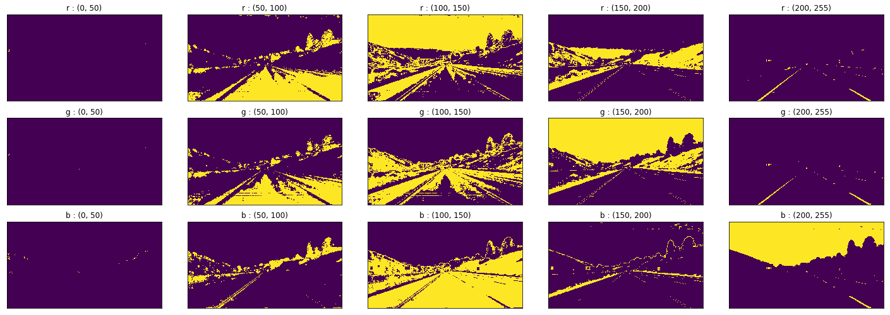
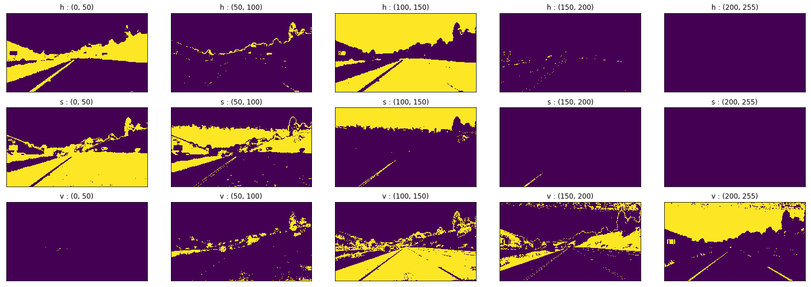

# **Finding Lane Lines on the Road**

## Overview
### Problem description
We built a pipeline that identifies and tracks the position of lane lines 
on the road in a series of images.

### Goals
We aimed to, in a rough sense, accurately annotate 
left and right lanes thoughout the provided two videos.

---

## Pipeline

### 1) Color threshold - HSV color space
The lane lines on the road are painted in consistent colors, white or yellow, 
on the dark background. Inspection of the color intensities in 
RGB and HSV color space for various thresholds are shown below. 

We concluded that thresholding of HSV color space, especially 
S channel and V channel, performs better. The color thresholded
binary mask is compared to the original image below. 
The combination of S channel and V channel seem to pick up 
both white lane lines and yellow lane lines pretty well. 

### 2) 

## Reflection

### 2. Identify potential shortcomings with your current pipeline

One potential shortcoming would be what would happen when ... 

Another shortcoming could be ...

### 3. Suggest possible improvements to your pipeline

A possible improvement would be to ...

Another potential improvement could be to ...
