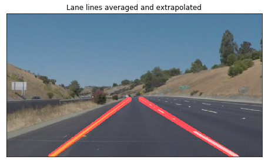

# Finding Lane Lines on the Road

## Overview
### Problem description
We built a pipeline that identifies and tracks the position of lane lines 
on the road in a series of images.

### Goals
We aimed to, in a rough sense, accurately annotate 
left and right lanes thoughout two videos provided.

## Pipeline
The pipeline consists of five steps as following. 

### 1) Color threshold - HSV color space
The lane lines on the road are painted in consistent colors, white or yellow, 
on the dark background. Inspection of the color intensities in 
RGB and HSV color space for various thresholds are shown below. 

We concluded that thresholding of HSV color space, especially 
S channel and V channel, performs better. The color thresholded
binary mask is compared to the original image below. 
The combination of S channel and V channel seem to pick up 
both white lane lines and yellow lane lines pretty well. 

### 2) Region selection
Though the color selection can summarize the information 
from the image quite well, it still contains unwanted noise. 
For example, the test image after color selection still 
shows the lawn on the both sides of the road which was selected 
because of its yellowish color. We can further summarize the image 
with region selection.

Assuming our camera has a fixed point of view and front facing,
the lanes almost always appear on the bottom half of the image,
and in the form of trapezoid. By restricting out region of interest,
 we can crop out the lane lines. 
Ths below image displays binary mask after color thresholding and region selection
were applied. The red boundaries in shape of trapezoid
 were manually selected as shown in the cell 4 in the [Jupyter notebook](https://github.com/JennyLeeStat/Finding_lane_lines/blob/master/P1.ipynb).

### 3) Canny edge detection

Lane markings generally appear as long lines. 
In order to detect the lines, we first need to identify 
the boundaries of the object. Canny edge detection 
finds the boundaries of object in an image by tracing out pixels 
following the strongest gradients. 
Gaussian blurring of kernel size 5 was applied before running 
Canny edge detection to suppress noises.

The figure below shows the detected edges. 
It traced out our target pretty well.

### 4) Hough transform line detection
We further sift through the pixels associated edges to find straight lines. 
Lines in the the Cartesian coordinate system correspond to 
the sin curve in Polar coordinate system (Hough space). 
If the curves of two points intersect in Hough space, it means both points 
belong to a same line. In general, a line can be declared by 
finding the intersection between curves.

The selected grid resolution was: `theta = pi/180, rho = 2`. The 
final parameter chosen were:`threshold = 50, min_line_len = 50, max_line_gap = 50`.

### 5) Averaging and Extrapolating identified lines
The identified lines in above figure can be further improved 
in terms of visual guidance for drivers. To map out sigle left lane
 and single right lane, a linear model was implemented. 
 The lines found by Hough transform are actually a list of 
 tuples containing four numbers: `x1, y1, x2, y2`, coordinates of
  two points. These are split into two sets, left lanes and right 
  lanes, depending on the slope of the line they form. 
  Then separate linear model is fitted using each set. 
  Using the fitted parameters, each line is extrapolated to 
  have the lower end at the bottom of the image, and upper end 
  at the same as the highest height of combined set. 
  The figure below displays the fully mapped out extrapolated/ 
  averaged lane lines annotated on a test image.

## Result

We applied the pipeline on two video files and 
the annotated lane lines seems pretty accurate.
The result video files can be found in the cell 16 and 18 
in the [Jupyter notebook](https://github.com/JennyLeeStat/Finding_lane_lines/blob/master/P1.ipynb).

## Reflection

We applied Hough transformation and linear regression 
to find the lane lines assuming the lane lines are straight. 
However, this is not always the case. If the road curves steeply, 
it is highly likely that our model fails to annotate the lane lines 
as accurate as we saw above. We would need other sophisticated 
computer vision techniques to detect curved lines to 
improve this drawback.

The possibly most important shortcoming of this pipeline is 
that the parameters used are manually chosen. For example, 
pixel intensities thresholds for color selection, 
and vertices for ROI trapezoid were selected after iterative trials.
 They were selected because it appeared performing okay but does not 
 comes with the guarantee of the globally best performance. 
 Moreover, it probably will not perform as good with test images 
 it’s never seen. Any change in position of camera, shade or light 
 will harm the performance. Augmenting training images 
 via random rotation, zooming, and shifting can improve 
 the performance of the model.